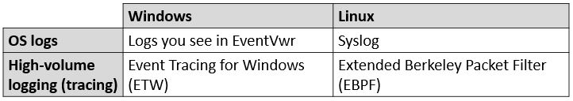

# Real-Time KQL Tools

The KQL tools are intended for anyone who wants to explore events in the Windows or Linux OS logs and high-volume logging/tracing streams. Examples of people who might find this useful are security researchers, security incident responders, IT administrators, OS developers and support professionals. 

The tools use the same [Kusto Query Language (KQL)](https://docs.microsoft.com/en-us/azure/data-explorer/kusto/query/), that powers Azure services such as Azure Data Explorer (ADX), Log Analytics and App Insights.
In all these services the assumption is that the data is uploaded to the cloud first, before it can be queried.

In contrast, the Real-Time KQL Tools apply standing-query directly on the stream of events:

Here the eel symbol stands for [Rx.KQL](Source/Rx.Kql/Readme.md): a stream-processing library, which  is the main component included in all the tools.

Note that Rx.KQL supports only [subset](Source/Rx.Kql/Docs/KqlSubset.md) of the KQL language. If you need some operator that is not supported, you will have to upload the data to ADX.

## Output choices

The simplest mode of using the tools is exporting to local files. This works even if the machine is disconnected from the network, and is useful to get general idea what events exist and when they occur. 

It is also useful to observe the behavior in real-time mode. For example, set the output to console and try various actions to see if the trigger events.

The option to upload events to ADX allows more complex analysis such as:
- the full KQL language
- Joins with other clusters or tables such as reference data or events uploaded from different OS/machines

In this mode you can upload all events without processing, or apply pre-processing query such as filtering only the events of interest, transformation and aggregation.

## Tools and input choices 

There are different tools for different log types:

- [WinLogKql](Source/WinLogKql/Readme.md): for Windows OS logs and *.evtx files
- [EtwKql](Source/EtwKql/Readme.md): for Event Tracing for Windows (ETW)
- [SyslogKql](Source/SyslogKql/Readme.md): For Syslog local files or to listen to Syslog in real-time
- [EbpfKQL](Source/EbpfKql/Readme.md): For dynamic interception of kernel calls in Linux

Each tool has a command-line option to choose between one-time processing/upload of files or continuous real-time processing/upload

## Contributing

This project welcomes contributions and suggestions.  Most contributions require you to agree to a
Contributor License Agreement (CLA) declaring that you have the right to, and actually do, grant us
the rights to use your contribution. For details, visit https://cla.opensource.microsoft.com.

When you submit a pull request, a CLA bot will automatically determine whether you need to provide
a CLA and decorate the PR appropriately (e.g., status check, comment). Simply follow the instructions
provided by the bot. You will only need to do this once across all repos using our CLA.

This project has adopted the [Microsoft Open Source Code of Conduct](https://opensource.microsoft.com/codeofconduct/).
For more information see the [Code of Conduct FAQ](https://opensource.microsoft.com/codeofconduct/faq/) or
contact [opencode@microsoft.com](mailto:opencode@microsoft.com) with any additional questions or comments.
