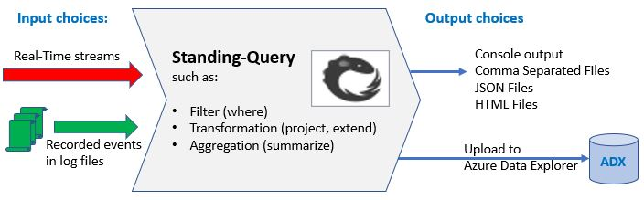

# Real-Time KQL 

The Real-Time KQL tools allow the user to explore the events by directly viewing and querying real-time streams. For example, you can filter the stream and show only the events of interest. You can choose which properties of the events to display, and group/count certain events in a time window:

Instead of "loading data" **and then** "querying" everything happens **as events arrive**. 

For example:

- if an event does not match a filter it is ignored
- if the event fits in predefined time-window, its numerical data is added to the aggregation computational state. At the end of the window, the aggregation result is produced as output event and the state is reset.

The tool can be used in offline mode, on the source machine. In this mode, it is just a better alternative of the limited OS tools like grep in Linux and EventVwr in Windows.

Here is how to use the tool to see processes started on a Windows machine:

	RealTimeKql winlog --logname=Security --kqlquery=ProcessCreation.kql --logtoconsole

The same on Linux:

	RealTimeKql syslog --kqlquery=SylogQuery.kql --logtoconsole

Optionally, the tool can be used for prepossessing the steam and then uploading to a database, such as Azure Data Explorer (ADX = Kuso)

## Input choices

The tool is designed to work on a real-time stream, which may never end. Optionally, you can pass in files(s) and they will be read only once and processed as a stream.  

The supported options are:

- Windows:
	- **winlog**: OS or application log you see in EventVwr
	- **evtx**: log file(s) on disk. Example is file(s) copied from another machine
	- **etwSession**: real-time session in Event Tracing for Windows (ETW)
	- **etl**: previously recorded "Event Trace Log" by using ETW
- Linux:
	- **syslog**: the OS log (coming soon)
	- **ebpf**: dynamic interception of kernel and user mode functions (coming soon)

## Query file

The query file describes what processing to apply to the events on the stream. It uses a subset of the Kusto Query Language(KQL) which is specifically useful for real-time viewing and prepossessing of streams.

The best practice to create query files is:

- Upload some raw events into Kusto (ADX), without specifying query-file
- Look at the data, and define some useful query that shows what you want as output
- Save the query as **.kql** file and pass this in the RealTimeKQL command line

Here are the query files for the two example command-lines above:

- Processes started on Windows
- Processes started on Linux

## Output choices

The output of the tool is also treated as a stream, and can be infinite.
Here are the options:

- Real-Time user experiences:
	- **consoleOutput**: the result is printed on screen (standard output), and it will roll-off depending how you setup the console window buffer
	- **webEvents** the tool acts as real-time server for events. Users whose browser is compatible with HTML5 standard can see events in real-time.
- Files
	- **csvOutput**: Each event is a row in Comma Separated Value table
	- **jsonOutput**: Each event is a JSON dictionary
	- **htmlOutput**: Each event formatted as human-readable DIV element
- Upload 
	- **adxOutput**: Upload to Kusto (Azure Data Explorer)

Detailed help for RealTimeKql can be found at, [RealTimeKqlHelp](Source/RealTimeKql/RealTimeKql.Readme.md)

## Contributing

This project welcomes contributions and suggestions.  Most contributions require you to agree to a
Contributor License Agreement (CLA) declaring that you have the right to, and actually do, grant us
the rights to use your contribution. For details, visit https://cla.opensource.microsoft.com.

When you submit a pull request, a CLA bot will automatically determine whether you need to provide
a CLA and decorate the PR appropriately (e.g., status check, comment). Simply follow the instructions
provided by the bot. You will only need to do this once across all repos using our CLA.

This project has adopted the [Microsoft Open Source Code of Conduct](https://opensource.microsoft.com/codeofconduct/).
For more information see the [Code of Conduct FAQ](https://opensource.microsoft.com/codeofconduct/faq/) or
contact [opencode@microsoft.com](mailto:opencode@microsoft.com) with any additional questions or comments.
