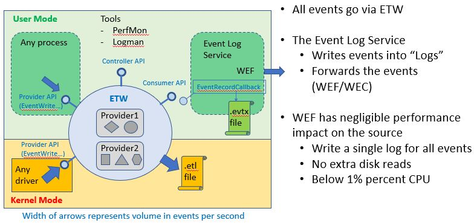

# Etw2Kusto command line tool

This tool is intended for isolated experiments with individual machines, and for learning ETW (Event Tracing for Windows) data. 

This tool uses the same components we intend to add into the agent for ASI. Note that the tool itself is not intended to be run as "agent". Although it is possible to run it on multiple machines, it lacks restart mechanism (like NT Services) and configuration mechanism (like the coordination  to deploy new detections in WEC and K9). 

Good usage of the tool is to: 

- start ETW into file or real time session
- run some POC for secur ity exploit (e.g. outbound or inbound attack)
- take your time to understand the data in Kusto
- use the learning to define queries that can be executed by Rx.KQL in actual agent
- use the pre-processing option of the tool to validate the query works as expected
- Add the query to ASI 

## Context on ETW, and how it is different from "Logs"
The following picture shows the ETW and Logs design in the Windows OS:

Here the ETW ecosystem was build by the "Core OS Performance" team in Windows, and is being used by developers and support engineers. The two most popular modes of ETW usage are:

- Real-time subscription to events, in which another process receives events as they occur, without anything hitting disk. This works to about 500,000 events per second
- High-volume recording to disk. This produces .etl file (Event Trace Log) and can handle 300,000 events/sec at below 5% CPU impact.

What is known as "Logs" was build by the Crimson team (general area is Windows Manageability) and targeted end-users and administrators who can use "human actionable" events:

- The Event Log Service listens to real-time subscriptions, writes to logs and forwards events
- "Logs" are binary XML that can be read by system tools like EventVwr. The top recording speed of this mechanism is about 1000 events per second.

For more, see the [original document](Unified%20Eventing%20Model.doc)

## Etw2Kusto tool modes of operation

There are two modes of operation for the Etw2Kusto tool:

### Real time mode

To use real-time mod, you can create ETW session with system tools such as logman.exe or perfmon to create a real-time session. For example let's create a session that uses ETW from the TCPIP.sys driver:

	logman.exe create trace tcp -rt -nb 2 2 -bs 1024 -p {7dd42a49-5329-4832-8dfd-43d979153a88} 0xffffffffffffffff -ets

Then from administrator prompt run:

	Etw2Kusto cluster:CDOC database:GeorgiTest table:EtwTcp session:tcp

Here we let the tool upload all the events into the table "EtwTcp"

The tool clears the table "EtwTcp" and then shows output such as:

	Listening to real-time session 'tcp'. Press Enter to termintate
	1652 2005 2071 2072 2027 2342

Every 10 seconds a new number appears, and shows how many new events were uploaded. 

### File upload mode

In this mode you can record events into etl file using only the OS features, and tools like PerfMon or Logman to switch on/off the recording.

Then, you upload the files into Kusto:

	Etw2Kusto cluster:CDOC database:GeorgiTest table:EtwTcp file:*.etl 

This is useful to record trace with negligible impact, only using ETW. 

It allows the file to be uploaded from another machine that has the same exact OS and installed components.

## Pre-processing with Rx.KQL

Typically, you would want to use one of the modes above to upload all the data to Kusto and understand what it means. Then you define Kusto queries, and realize that much of the data is unnecessary.

At that point you can use Rx.KQL on the real-time stream to pre-process the events before uploading:

	Etw2Kusto cluster:CDOC database:GeorgiTest table:EtwTcp session:TcpRt query:TraficByIP.csl

Here the pre-processing query is aggregating the events:

	EtwTcp 
	| where EventId == 11
	| extend daddr = EventData.daddr
	| summarize c = count() by daddr, bin(TimeCreated, 1s)

The result is sometimes called "Net Flow data". It is useful to note that we don't need special appliances that capture IPFIX, nor are we making any assumptions how the network is implemented.

The pre-processing option is also available with the file-upload mode.